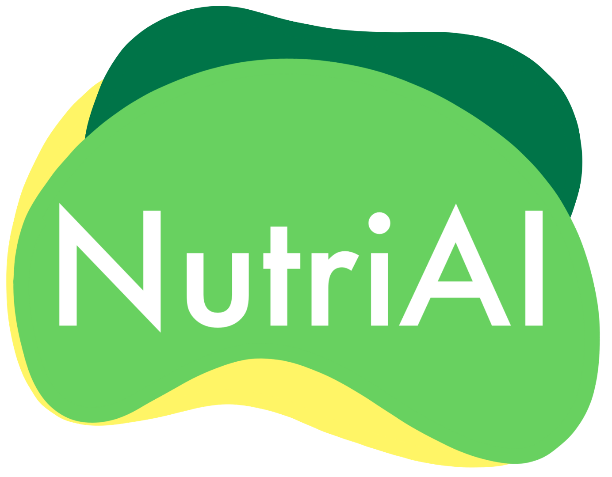
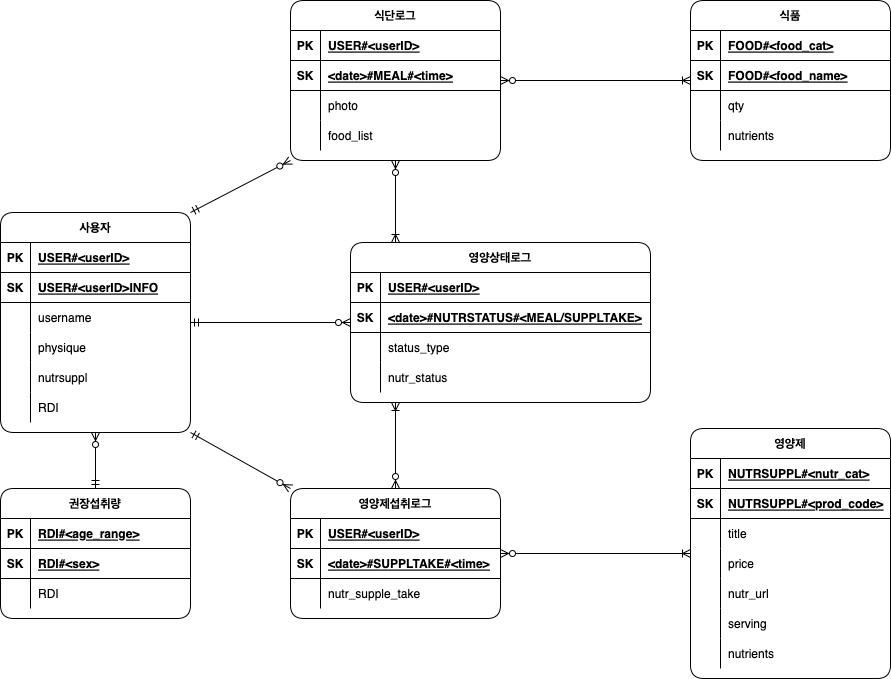

<!---
  README.md for NutriAI project
--->

 

  
   
  <h3 align="center">이미지 탐지를 통한 식단 분석 및 영양제 추천</h3>
  

    <a href="https://github.com/hyeniii">황혜원</a>
    ·
    <a href="https://github.com/Angwoo-the-Fuego">지영우</a>
    ·
    <a href="https://github.com/kymjaehong">김재홍</a>
    ·
    <a href="https://github.com/ziyoon">김지윤</a>
  

  

    2022.02 ~ 2022.03 | SK planet T-academy
     
    🥇 1st Place in T-academy and Medici Education Program
     
    
  

<!-- TABLE OF CONTENTS -->

  
Table of Contents

  <ul>
    <li>
      <a href="#overview">Overview</a>
      <ul>
        <li><a href="#service-component">Service Component</a></li>
        <li><a href="#short-video">Short Video</a></li>
      </ul>
    </li>
    <li><a href="#built-with">Built With</a></li>
    <li><a href="#data">Data</a></li>
    <li><a href="#erd">ERD</a></li>
    <li><a href="#development">Development</a></li>
  </ul>

## Overview
### Service Component
- 이미지를 통한 식단 기록
- 사용자 영양상태 확인
- 사용자 맞춤 영양제 추천

### Short Video

## Build With
- [Amazon DynamoDB](https://aws.amazon.com/dynamodb/)
- [Amazon EC2](https://aws.amazon.com/ec2/)
- [YOLOv3](https://github.com/ultralytics/yolov3)
- [FastAPI](https://fastapi.tiangolo.com/)
- [Flutter](https://flutter.dev/)

## Data
- [한국음식이미지 AIhub](https://aihub.or.kr/aidata/13594)
- [Imageye](https://chrome.google.com/webstore/detail/image-downloader-imageye/agionbommeaifngbhincahgmoflcikhm) - Image Downloader
- [AutoCrawler](https://github.com/YoongiKim/AutoCrawler)
- [식품의약품안전처](https://www.foodsafetykorea.go.kr/fcdb/)
- [IHerb Scrapping](https://github.com/Nutri-AI/Iherb_Scraping)

## ERD

  

## Development
- [Data Preprocessing](https://github.com/Nutri-AI/Iherb_Preprocessing)
- [Database](https://github.com/Nutri-AI/Database)
- [Model](https://github.com/Nutri-AI/yolov3_onnx_inf)
- [API](https://github.com/Nutri-AI/api-fastapi)
- [APP](https://github.com/Nutri-AI/Application)

